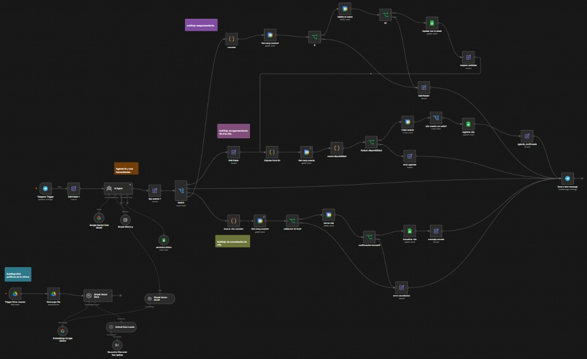

# Agente IA para automatización y gestión de citas de una clínica dental. 

Sistema automatizado basado en inteligencia artificial agentiva montado en n8n para la gestión, confirmamiento, cancelación, reagendamiento y respuesta a dudas relacionadas con la clínica y sus servicios. 

## Tecnologías utilizadas 

- n8n cloud: orquestador del flujo y automatización de procesos.
- Telegram API: interfaz y canal de comunicación con el usuario final.
- Google sheets API: Almacenamiento de citas y servicios de la clínica.
- Google calendar API: Agendamiento de citas en el calendario del dentista.
- Google drive API: Permite disparar el flujo automáticamente mediante un Trigger que vigila una carpeta de drive y cuando se   detecta un nuevo documento de políticas y lo descargar en tiempo real.
- Google gemini 3 flash: LLM para conversar con el usuario final.
- Embeddings google: Modelo que extrae y convierte el texto en vectores.
- Simple Vector Store: Base de datos vectorial indexada en memoria que almacena los vectores generados y expone una herramienta para que el Agente de IA realice búsquedas semánticas rápidas durante la conversación.

## Arquitectura y flujo de trabajo.

Descripción del flujo: 

1. El usuario interactúa mediante el canal de telegram.
2. El AI Agent centraliza la conversación, analiza el contexto y determina la intención del usuario.
3. El nodo central de clasificación filtra las intenciones principales (CONFIRMACION, REAGENDAR, CANCELACION, TEXTO_NORMAL).
4. Las ramas operativas procesan los datos correspondientes.
5. Un nodo final unificado procesa la respuesta humana y la envía de vuelta al usuario.
